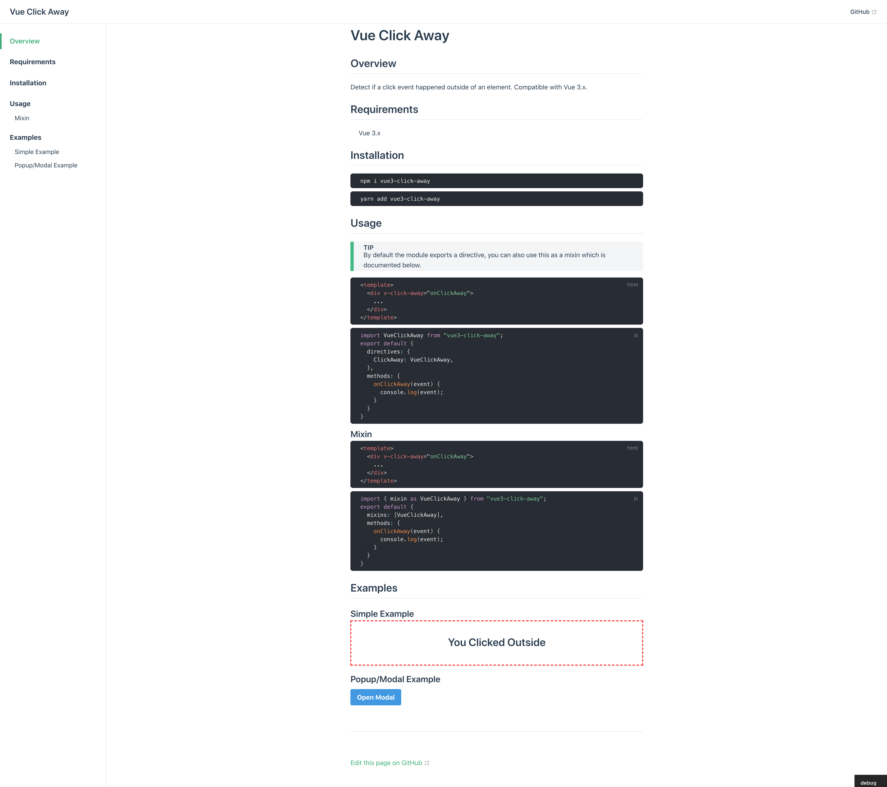

# Vue Click Away

> Demo is available using VitePress and is included in this repository. See [Demo](#demo) Section on how to use and the reason why it's not live yet.

> Vue 3.0 Compatible Click Away Directive

[](https://www.npmjs.com/package/vue3-click-away)


## Overview

Detect if a click event happened outside of an element. Compatible with Vue 3.x.

## Requirements

- Vue 3.x

## Installation

```
npm i -s vue3-click-away
```

<p></p>

```
yarn add vue3-click-away
```

## Usage

> By default the module exports a directive, you can also use this as a mixin which is documented below.

```html
<template>
  <div v-click-away="onClickAway">
    ...
  </div>
</template>
```

<p></p>

```js
import VueClickAway from "vue3-click-away";
export default {
  directives: {
    ClickAway: VueClickAway,
  },
  methods: {
    onClickAway(event) {
      console.log(event);
    }
  }
}
```

### Mixin

```html
<template>
  <div v-click-away="onClickAway">
    ...
  </div>
</template>
```

<p></p>

```js
import { mixin as VueClickAway } from "vue3-click-away";
export default {
  mixins: [VueClickAway],
  methods: {
    onClickAway(event) {
      console.log(event);
    }
  }
}
```

## Demo

Currently VitePress is having an issue building for production since Directives require SSR implementation and there is no way to override this or skip it (VuePress has ClientOnly component, VitePress doesn't, Yet). 

I've opened an issue and pending to see if there is a way to go around it, [Click Here](https://github.com/vuejs/vitepress/issues/92) to view the issue reported.

For the time being, to test this out clone the repository and run the following inside the `/docs` folder

```
npx vitepress
```





